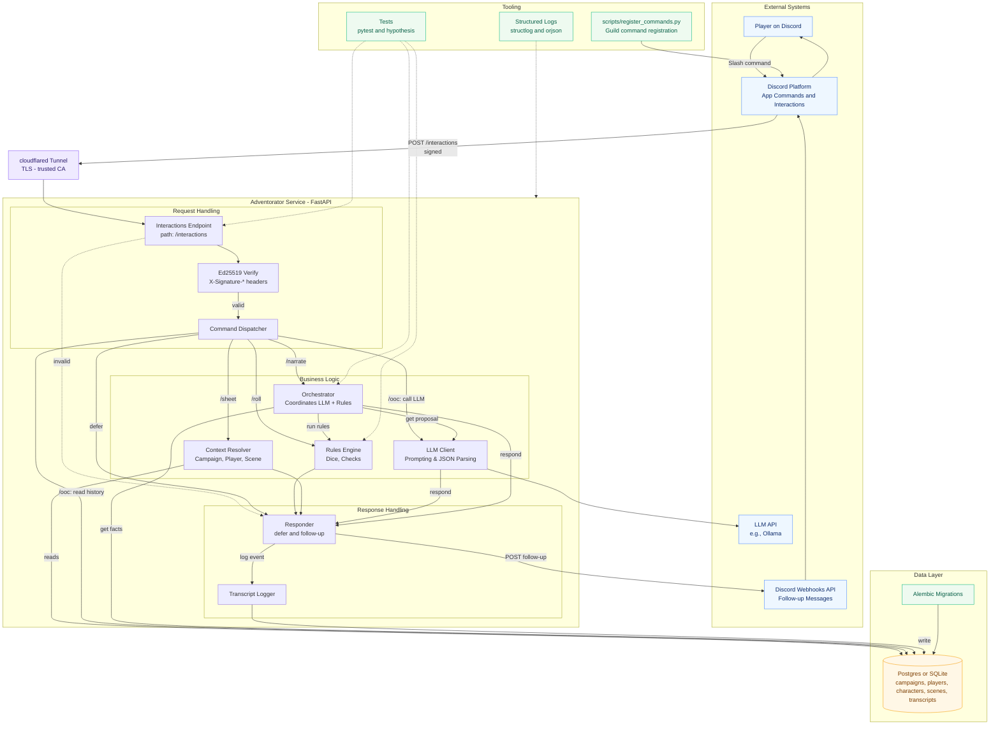
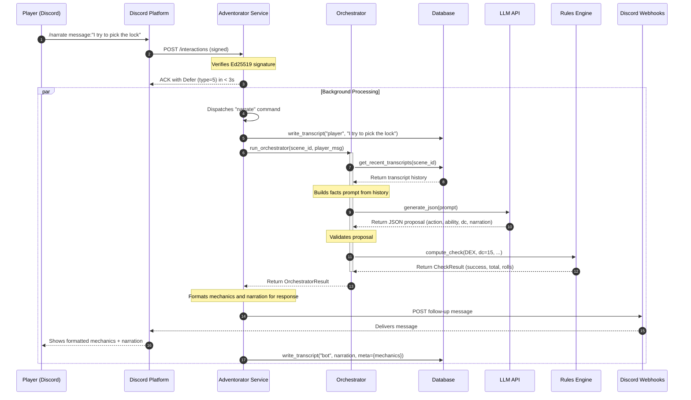
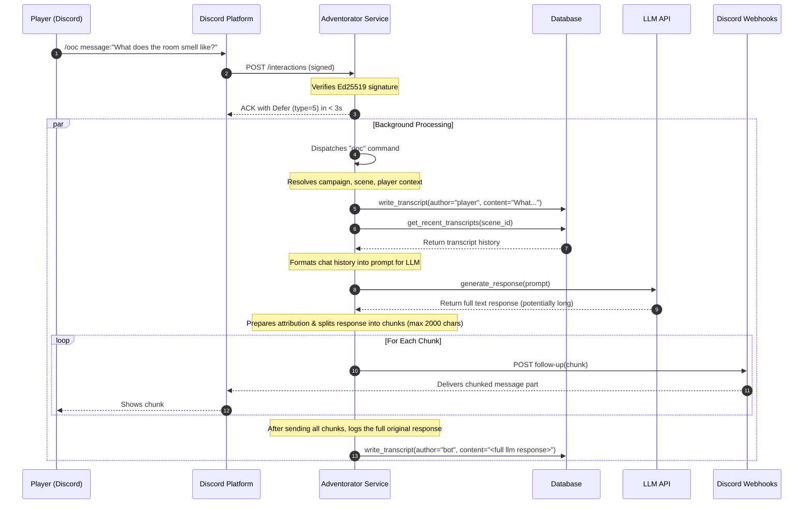

# Adventorator

*The best adventures are the ones **no one** has to plan.*

A Discord-native Dungeon Master bot that runs tabletop RPG campaigns directly in chat. It blends deterministic game mechanics with AI-powered narration, letting players experience a text-based campaign without needing a human DM online 24/7.


---

1. [Adventorator](#adventorator)
    1. [Overview](#overview)
    2. [Prerequisites](#prerequisites)
    3. [Quickstart](#quickstart)
        1. [Optional: Anonymous Cloudflare tunnel:](#optional-anonymous-cloudflare-tunnel)
    4. [Database \& Alembic](#database--alembic)
    5. [Repo Structure](#repo-structure)

---

## Overview

**✨ Features (MVP and beyond)**

* Discord-first gameplay
* Slash commands (/roll, /check, /sheet, /act) and interactive components (buttons, modals).
* Combat threads with initiative order, per-turn locks, and timeouts.
* Ephemeral prompts for individual player actions.
* Deterministic rules engine
* Full SRD 5e dice system (advantage/disadvantage, crits, modifiers).
* Ability checks, saving throws, AC, HP, conditions.
* Initiative and turn management with audit logging.
* Campaign persistence
* JSON-schema character sheets stored in Postgres (or SQLite for dev).
* Adventure content as structured "nodes" (locations, NPCs, encounters).
* Automatic transcripts and neutral session summaries.
* AI-assisted narration (behind feature flag)
* LLM proposes DCs and narrates outcomes; Rules Service enforces mechanics.
* Retrieval-augmented memory: previous sessions, adventure nodes, campaign facts.
* Configurable tone, verbosity, and house rules.
* Developer experience
* Python 3.10+, FastAPI interactions endpoint, Redis for locks/queues.
* Pydantic models, property-based tests for dice & checks.
* Structured JSON logs, reproducible seeds, feature flags for every subsystem.

**🏗 Architecture**

* Discord Interactions API → FastAPI app → defer in <3s → enqueue background job.
* Rules Service (pure Python functions) → resolves rolls, DCs, initiative, mutations.
* Database → campaign state, character sheets, transcripts.
* Optional LLM → narrates and proposes rulings, never mutates state directly.
* Workers → long-running tasks: narration, summarization, content ingestion.
 
**Diagram: High-Level Architecture**



**Diagram: Narrate Command Flow**



**`/ooc` command flow**




**🔒 Design philosophy**

* AI narrates, rules engine rules. No silent HP drops or fudged rolls.
* Human-in-the-loop. GM override commands (/gm) and rewind via event sourcing.
* Defensive defaults. Feature flags, degraded modes (rules-only if LLM/vector DB down).
* Reproducible. Seeded RNG, append-only logs, golden transcripts for regression tests.

**🚧 Status**

* [X] Phase 0: Verified interactions endpoint, 3s deferral, logging.
* [X] Phase 1: Deterministic dice + checks, /roll and /check commands.
* [X] Phase 2: Persistence (campaigns, characters, transcripts).
* [ ] Phase 3: Shadow LLM narrator, proposal-only.
* [ ] Phase 4+: Combat system, content ingestion, GM controls, premium polish.

**🔜 Roadmap**

* Add /sheet CRUD with strict JSON schema.
* Initiative + combat encounters with Redis turn locks.
* Adventure ingestion pipeline for SRD or custom campaigns.
* Optional Embedded App for lightweight maps/handouts in voice channels.

---

## Prerequisites

- Bash-like environment
- Docker
- Python > 3.10
- [uv](https://docs.astral.sh/uv/getting-started/installation/)

    ```bash
    curl -LsSf https://astral.sh/uv/install.sh | sh
    ```

- [cloudflared](https://developers.cloudflare.com/cloudflare-one/connections/connect-networks/downloads/)

    ```bash
    # Linux
    wget https://github.com/cloudflare/cloudflared/releases/latest/download/cloudflared-linux-arm
    sudo cp ./cloudflared-linux-arm /usr/local/bin/cloudflared
    sudo chmod +x /usr/local/bin/cloudflared
    cloudflared -v

    # MacOS
    brew install cloudflared
    ```

## Quickstart

```bash
cp .env.example .env    # <-- Add secrets
make dev                # Install Python requirements
make run                # Start local dev server on 18000
```

### Optional: Anonymous Cloudflare tunnel:

```bash
make tunnel
```

In the output, you should see something like:

    ```
    2025-09-05T18:57:54Z INF |  Your quick Tunnel has been created! Visit it at (it may take some time to be reachable):  |
    2025-09-05T18:57:54Z INF |  https://rooms-mechanics-tires-mats.trycloudflare.com  
    ---

Discord can now reach your dev server using that URL + `/interactions`.

---

## Database & Alembic

Adventorator uses SQLAlchemy with Alembic migrations. You’ll need to initialize your database schema before running commands that hit persistence (Phase 2+).

```bash
# Create the database (SQLite default, Postgres if DATABASE_URL is set)
alembic upgrade head
```

This will apply all migrations in `migrations/versions/` to your database.

Common commands:

```bash
# Generate a new migration after editing models.py
alembic revision --autogenerate -m "describe your change"

# Apply latest migrations
alembic upgrade head

# Roll back one migration
alembic downgrade -1
```

By default, `alembic.ini` points at your `DATABASE_URL` (set in `.env` or config).
For quick local dev you can rely on SQLite (`sqlite+aiosqlite:///./adventurator.sqlite3`), but Postgres is recommended for persistent campaigns.

---

That way, someone can go from `make dev` → `alembic upgrade head` → bot commands writing to DB.

---

## Repo Structure

```
.
├── alembic.ini                  # Alembic config for database migrations
├── config.toml                  # Project-level config (env, feature flags, etc.)
├── Dockerfile                   # Container build recipe
├── docs                         # Documentation assets and guides
├── Makefile                     # Common dev/test/build commands
├── migrations                   # Alembic migration scripts
│   ├── env.py                   # Alembic environment setup
│   └── versions                 # Generated migration files
├── pyproject.toml               # Build system and tooling config (ruff, pytest, etc.)
├── README.md                    # Project overview and usage guide
├── requirements.txt             # Python dependencies lock list
├── scripts                      # Utility/CLI scripts
│   ├── aicat.py                 # Quickly cat combined source files for copying to clipboard
│   └── register_commands.py     # Registers slash commands with Discord API
├── src                          # Application source code
│   └── Adventorator             # Main package
│       ├── app.py               # FastAPI entrypoint + Discord interactions handler
│       ├── config.py            # Settings loader (TOML + .env via Pydantic)
│       ├── crypto.py            # Ed25519 signature verification for Discord
│       ├── db.py                # Async SQLAlchemy engine/session management
│       ├── discord_schemas.py   # Pydantic models for Discord interaction payloads
│       ├── logging.py           # Structlog-based logging setup
│       ├── models.py            # SQLAlchemy ORM models (Campaign, Player, etc.)
│       ├── repos.py             # Data access helpers (CRUD, queries, upserts)
│       ├── responder.py         # Helpers for Discord responses and follow-ups
│       ├── rules                # Deterministic rules engine (dice, checks)
│       │   ├── checks.py        # Ability check logic & modifiers
│       │   └── dice.py          # Dice expression parser and roller
│       └── schemas.py           # Pydantic schemas (e.g., CharacterSheet)
└── tests                        # Unit and integration tests
    ├── conftest.py              # Pytest fixtures (async DB session, etc.)
    └── data                     # Sample payloads/test data
```

---