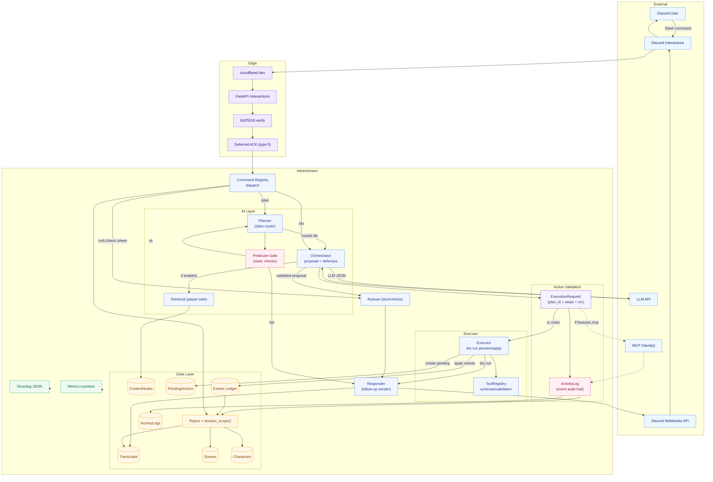
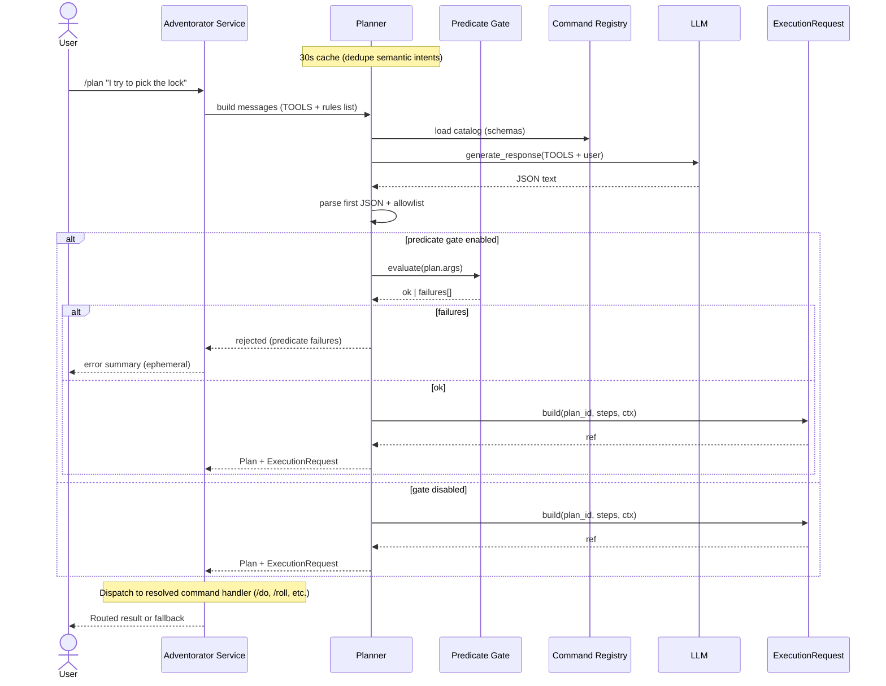
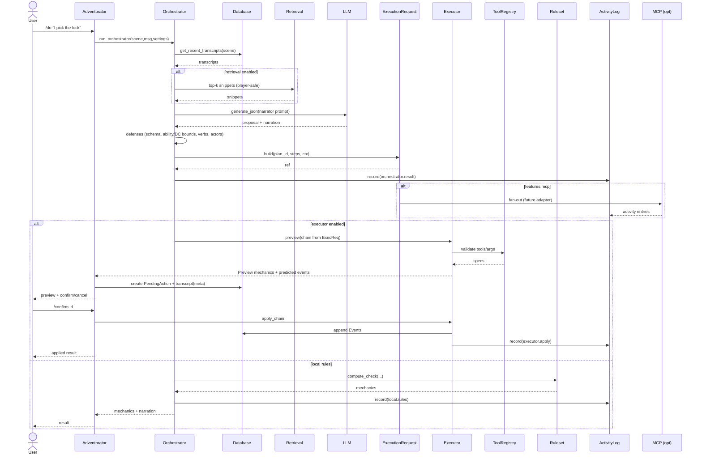

# Adventorator

The best adventures are the ones no one has to plan.

A Discord-native Game Moderator bot that blends deterministic Tabletop RPG mechanics with dynamic narration. Play end-to-end inside a Discord channel.
- [MVP Definition](#mvp-definition)
- [Overview](#overview)
- [Prerequisites](#prerequisites) & [Quickstart](#quickstart)
- [Docker Compose Dev (with Feature Flags)](#docker-compose-dev-with-feature-flags)
- [Database & Alembic](#database--alembic)
- [Configuration](#configuration)
- [Retrieval & Safety](#retrieval--safety)
- [Key Command Flows](#key-command-flows)
- [Operations](#operations)
- [AI Development Pipeline Onboarding](#ai-development-pipeline-onboarding)
- [Repo Structure](#repo-structure)
- [Contributing](./CONTRIBUTING.md)
- [Changelog](./CHANGELOG.md)
 - [Roadmap](./ROADMAP.md)

> Encounters (Phase 10)
- See docs: [Encounters (dev notes)](./docs/dev/encounters.md)
- Feature flag: enable `[combat].enabled=true` in `config.toml` (legacy fallback to `[features].combat` is supported).
- Command: `/encounter status` (FF-gated) shows current round, active combatant, and initiative order.


---

## MVP Definition

End-to-end automated DnD 5e campaign management within a Discord channel for all members with an assigned character sheet (a party):

- Campaign data uploaded as a .zip via `/campaign upload` with well-formed definitions for important people, places/geography, history, theme, etc. LLM tools can safely fill reasonable gaps.
- Gameplay swaps between exploration (asynchronous, free-form) and encounter (synchronous, opt-in, turn-order) modes according to party actions.
- Core commands and roles:
  - `/plan` — Take in-character actions that don’t affect shared state, or preview actions that do.
  - `/do` — Attempt to take actions that affect other players or world state (guarded by preview/confirm).
  - `/sheet create|upload|show [id]` — Manage character sheets.
  <!-- Removed undocumented /campaign command (not yet implemented; future ingestion epic will introduce official commands). -->
  - Plus `/roll`, `/check`, and emergent GM tools under feature flags.

---

## Architecture

A modular, layered system designed for security, determinism, and safe AI integration.

Components at a glance
- FastAPI edge (`app.py`): Verify Ed25519 signatures, defer within 3s, dispatch commands in the background, and send follow-ups via a `Responder` (Discord webhooks or dev sink).
- Command registry (`commanding.py` + `command_loader.py`): `@slash_command` decorator with Pydantic option models; handlers in `commands/` receive an `Invocation` with a transport-agnostic `Responder`.
- Rules engine (`rules/`): Deterministic mechanics (dice, checks) via `Dnd5eRuleset`; seedable RNG for reproducible tests.
- Data layer (`db.py`, `models.py`, `repos.py`): Async SQLAlchemy with `session_scope()`, typed models, and repo helpers. Transcripts capture all user/bot I/O.
- AI layer (`planner.py`, `orchestrator.py`, `llm*.py`): Planner routes `/plan` intent to a strict command; Orchestrator proposes mechanics + narration, validates defensively, and runs rules.
- Retrieval (`retrieval.py`): Player-safe content snippets augment prompts; GM-only text never leaves the DB.
- Executor + ToolRegistry (`executor.py`, `tool_registry.py`): JSON ToolCallChain with dry-run previews and validated arg schemas.
- Pending actions + confirm (`models.PendingAction`, `commands/confirm|cancel|pending.py`): Previews that require explicit confirmation before apply.
- Event ledger (`models.Event`, folds in `repos.py`): Append-only mutations with replay support; executor apply emits events.
- Observability: JSON logs with request_id, metrics counters, and feature flags for safe rollback: `[features].llm`, `[planner].enabled`, `[features].executor`, `[features].executor_confirm`, `[features].events`, `[features.retrieval].enabled`, `[ops].metrics_endpoint_enabled`.

Diagram: current system (with Action Validation phases)



### Core AI Components: Planner, Orchestrator, and Executor

A clear separation of concerns keeps AI flexible while game mechanics stay deterministic and safe. Three components work together:

#### Planner (semantic router)

File: `Adventorator/planner.py`

- Role: Map freeform intent from `/plan` to a specific, validated slash command in the registry.
- How it works:
  - Builds a live catalog from the command registry (`command_loader` + `all_commands`), including Pydantic v2 option schemas.
  - Prompts the LLM with TOOLS + minimal rules context, then extracts the first JSON object.
  - Produces a single-step `Plan` (legacy `PlannerOutput` internally adapted) and enforces an allowlist: `{roll, check, sheet.create, sheet.show, do}`.
- Contract (inputs/outputs):
  - Input: `user_msg: str`
  - Output: `Plan | None` (Level 1 ⇒ exactly one `PlanStep {op,args}`)
  - Side effects: None (pure function over LLM; in-process 30s cache suppresses repeats)
- Defenses & failure modes:
  - Rejects non-JSON or invalid JSON (returns `None`).
  - Refuses commands not on the allowlist.
  - Metrics and logs: `planner.request.initiated`, `planner.parse.failed`, `planner.validation.failed`, `planner.parse.valid`.

#### Orchestrator (narration + mechanics)

File: `Adventorator/orchestrator.py`

- Role: For narrative actions (e.g., `/do`), collect context, ask LLM for a proposal, defend it, and produce mechanics + narration. Optionally routes mechanics to the Executor for preview/confirm flows.
- Pipeline:
  1) Facts: Fetch recent `transcripts` via `repos` and format with `build_clerk_messages`.
  2) Retrieval (optional): If enabled by settings, augment with player-safe `ContentSnippet`s.
  3) LLM: Build narrator messages and call `generate_json()` to get strictly parsed `LLMOutput`.
  4) Defenses: Require `action == "ability_check"`, ability in `ABILS`, `5 <= DC <= 30`; block banned verbs in proposal/narration; optionally reject unknown actors.
  5) Mechanics: Either compute locally via `rules.checks` or use the Executor preview path to produce a `ToolCallChain`.
  6) Format: Return an `OrchestratorResult` with mechanics string, narration, and optional `chain_json`.
- Contract (inputs/outputs):
  - Input: `(scene_id: int, player_msg: str, sheet_info_provider?: (ability)->{score, proficient, expertise, prof_bonus}, character_summary_provider?, rng_seed?, llm_client, prompt_token_cap?, allowed_actors?, settings?, actor_id?)`
  - Output: `OrchestratorResult` `{mechanics: str, narration: str, rejected?: bool, reason?: str, chain_json?: dict}`
  - Side effects: Reads transcripts (DB), optional retrieval, increments metrics, 30s in-process prompt cache.
- Feature flags and knobs:
  - `features_executor` routes to Executor preview; otherwise computes locally with `rules`.
  - Retrieval is gated in settings (player-safe only).
  - Determinism aided by `rng_seed` during tests.
- Defenses & failure modes:
  - Invalid LLM output → rejected with reason (`llm_invalid_or_empty`, `Unsupported action`, `Unknown ability`, `DC out of acceptable range`, `unsafe_verb`).
  - Unknown actors defense compares narration tokens to `allowed_actors`.
  - Metrics: `llm.request.enqueued`, `llm.response.received`, `llm.defense.rejected`, `orchestrator.format.sent`.

#### Executor (preview/apply tools)

File: `Adventorator/executor.py`

- Role: Execute mechanics as a declarative, validated tool chain. Supports dry-run previews (for `/do` confirmation) and apply (append events).
- Registry and built-ins:
  - `InMemoryToolRegistry` with JSON schemas per tool.
  - Built-in tools: `roll`, `check` (pure previews), and mutating stubs `apply_damage`, `heal`, `apply_condition`, `remove_condition`, `clear_condition` (emit domain events).
- Data contracts:
  - `ToolStep {tool: str, args: dict, requires_confirmation?: bool, visibility?: "ephemeral|public"}`
  - `ToolCallChain {request_id: str, scene_id: int, steps: [ToolStep], actor_id?: str}`
  - `PreviewItem {tool: str, mechanics: str, predicted_events?: [ {type, payload} ]}`
  - `Preview {items: [PreviewItem]}`
- Behavior:
  - `execute_chain(chain, dry_run=True)` → `Preview` (no side effects).
  - `apply_chain(chain)` → `Preview`; if `features_events` is enabled, append predicted events (or a generic mechanics event) to the Events ledger via `repos`/`session_scope()`.
- Failure modes & metrics:
  - Unknown tool names are warned and reported as preview items.
  - Timing and counters: `executor.preview.ok`, `executor.preview.duration_ms`, `executor.apply.ok`, `executor.apply.duration_ms`.

#### Why this separation?

- Security: The planner can only select approved commands; the orchestrator validates LLM output; the executor validates tool names/args.
- Testability: Rules stay deterministic; each layer is mockable (LLM client, registry, repos) and measurable via metrics.
- Rollout safety: Feature flags control LLM visibility, planner routing, executor preview/apply, events emission, and retrieval.

At runtime: `/plan` may select `/do`; the `/do` handler calls the orchestrator. If the executor is enabled, the orchestrator returns a `ToolCallChain` preview. The app persists a `PendingAction` and asks the player to confirm. On `/confirm`, the app calls `Executor.apply_chain`, which appends `Event`s; folds in `repos` update derived state for subsequent turns.

### Key Command Flows

#### Diagram Legend

- Validation (pink): Static or deterministic guards (Predicate Gate) and audit records (ActivityLog).
- Object (lavender): In-flight structured request objects (`ExecutionRequest`).
- MCP (dashed link): Optional future fan-out when `features.mcp` is enabled.
- Events vs Pending: Pending actions require confirmation; applied events mutate ledger for replay.
- Feature Flags: Planner (`[planner].enabled`), Predicate Gate (`features_predicate_gate`), Action Validation (`features_action_validation`), Executor (`features_executor`), Events (`features_events`), Retrieval (`features.retrieval.enabled`), MCP (`features.mcp`).

#### The `/plan` Command Flow

Semantically routes freeform input to a strict slash command using schemas from the registry. Often selects `/do`, which then uses the Orchestrator (and optionally the Executor preview path).



#### The `/do` Command Flow (preview → confirm → events)

Actions that affect shared state are previewed and require confirmation when the executor is enabled.



-----

## Prerequisites

  - Bash-like environment
  - Docker
  - Python \> 3.10
  - [uv](https://docs.astral.sh/uv/getting-started/installation/) (`curl -LsSf https://astral.sh/uv/install.sh | sh`)
  - [cloudflared](https://developers.cloudflare.com/cloudflare-one/connections/connect-networks/downloads/) (`brew install cloudflared` on macOS)

## Quickstart

```bash
cp .env.local.example .env.local   # <-- Add secrets (host dev)
make dev                     # Install Python requirements
make db-upgrade              # Initialize the database schema
make run                     # Start local dev server on port 18000
```

To expose your local server to Discord, run the Cloudflare tunnel in a separate terminal:

```bash
make tunnel
```

Discord can now reach your dev server using the tunnel URL + `/interactions`.

---

## Docker Compose Dev (with Feature Flags)

Spin up Postgres and the app together with docker compose. Configure feature flags in `config.toml` or `.env.docker` (copied from `.env.docker.example`).

```bash
make compose-dev   # uses .env.docker
```

Required env for compose dev (see `.env.docker.example`):

```env
DATABASE_URL=postgresql+asyncpg://adventorator:adventorator@db:5432/adventorator
# Discord
DISCORD_APPLICATION_ID=...
DISCORD_PUBLIC_KEY=...
DISCORD_BOT_TOKEN=...
# Feature flags (examples)
FEATURES_LLM=true
FEATURES_PLANNER=true
FEATURES_LLM_VISIBLE=false
FEATURES_EXECUTOR=true
FEATURES_EXECUTOR_CONFIRM=true
FEATURES_EVENTS=true
FEATURES_RETRIEVAL_ENABLED=true
```

Apply migrations from your host (or inside the app container):

```bash
make alembic-up
```

Tip: For quick local-only dev without containers, set `DATABASE_URL=sqlite+aiosqlite:///./adventorator.sqlite3` and use the Quickstart steps below.

---

## Database & Alembic

Adventorator uses SQLAlchemy with Alembic for database migrations. Initialize your database schema before running commands that require persistence.

```bash
# Apply all migrations (run this once on setup)
make db-upgrade
# OR
alembic upgrade head
```

Common commands:

```bash
# Generate a new migration after editing models.py
alembic revision --autogenerate -m "describe your change"

# Roll back one migration
alembic downgrade -1
```

By default, `alembic.ini` points at the `DATABASE_URL` from your configuration. For local development, SQLite is used by default.

See also: `migrations/README` for deeper Alembic usage, driver notes, and troubleshooting.

-----

## Configuration

Behavior is configured via `config.toml`, which can be overridden by environment variables loaded from `.env.local` (host) or `.env.docker` (compose). A legacy `.env` is still honored if `.env.local` is absent.

**Key Toggles:**

  * `features.llm`: Master switch for all LLM-powered features (`/do`, `/plan`).
  * `features.llm_visible`: If `true`, LLM narration is posted publicly; otherwise, it runs in a "shadow mode" (logged but not sent to Discord).
  * `[planner].enabled` — Hard on/off switch for the `/plan` planner (legacy fallback: `[features].planner`).
  * `ops.metrics_endpoint_enabled`: If `true`, exposes a `GET /metrics` endpoint.

**LLM Client:**

  * `llm.api_provider`: `"ollama"` or `"openai"`.
  * `llm.api_url`: Base URL for your provider (e.g., `http://localhost:11434` for Ollama).
  * `llm.model_name`: Model identifier (e.g., `"llama3:latest"`).

See `src/Adventorator/config.py` for all options and default values.

-----

## Retrieval & Safety

Phase 6 adds a simple, safe retrieval layer to augment the Orchestrator with player-visible lore snippets.

- Storage: `ContentNode` records with separate `player_text` and `gm_text`. Only `player_text` is ever returned to users or sent to the LLM.
- Retriever: A SQL LIKE fallback searches over `title`, `player_text`, and (for matching only) `gm_text` to improve recall. GM text is never surfaced.
- Feature flags (config.toml):
  - `features.retrieval.enabled` (bool): turn retrieval on/off.
  - `features.retrieval.provider` ("none" for SQL fallback; future: pgvector/qdrant).
  - `features.retrieval.top_k` (int): number of snippets to include.
- Orchestrator integration: when enabled, the top-k snippets for the active campaign are appended to the facts bundle as `[ref] <title>: <player_text>`.
- Safety defenses in the orchestrator:
  - Only allows the action `ability_check` with whitelisted abilities and a bounded DC (5–30).
  - Bans verbs implying state mutation (e.g., “deal damage”, “modify inventory”).
  - Detects unknown proper-noun actors, ignoring pronouns like “You/They”.

Content ingestion (CLI):

```bash
# Import a Markdown file as a content node
PYTHONPATH=./src python scripts/import_content.py \
  --campaign-id 1 \
  --node-type lore \
  --title "Ancient Door" \
  --file docs/examples/ancient-door.md
```

Metrics and logging:

- Retrieval counters: `retrieval.calls`, `retrieval.snippets`, `retrieval.errors`, `retrieval.latency_ms`.
- Orchestrator counters: `llm.request.enqueued`, `llm.response.received`, `llm.defense.rejected`, `orchestrator.format.sent`.
- JSON logs with context-rich events at boundaries; see `logs/adventorator.jsonl`.

Dev headers (local web CLI):

- `X-Adventorator-Use-Dev-Key`: trusts a development public key for local testing.
- `X-Adventorator-Webhook-Base`: reroutes follow-ups to a local sink during dev.

Tests & in-memory DB notes:

- The test suite uses a pure in-memory SQLite URL with a shared connection pool so schema persists across async sessions.
- A schema guard ensures tables are created before per-test purges; do not rely on Alembic for tests.
- If you see `no such table` in tests, ensure you’re not changing the test engine URL or pool configuration.

-----

## Commands

### Adding New Commands

The application uses a decorator-based system to discover and register new commands.

1.  **Create a command file** in `src/Adventorator/commands/`, e.g., `greet.py`:

    ```python
    # src/Adventorator/commands/greet.py
    from pydantic import Field
    from Adventorator.commanding import Invocation, Option, slash_command

    class GreetOpts(Option):
        name: str = Field(description="Who to greet")

    @slash_command(name="greet", description="Say hello", option_model=GreetOpts)
    async def greet(inv: Invocation, opts: GreetOpts):
        await inv.responder.send(f"Hello, {opts.name}!")
    ```

2.  **Test it locally** with the dynamic CLI:

    ```bash
    # The CLI auto-discovers the new command
    PYTHONPATH=./src python scripts/cli.py greet "World"
    ```

3.  **Register it with Discord:**

    ```bash
  # Fill out DISCORD_* variables in .env.local (host) or .env.docker (compose) first
    python scripts/register_commands.py
    ```

### Using the `/plan` Smart Router

`/plan` lets players use natural language, which is routed to a known command.

  * `/plan "roll 2d6+3 for damage"` → routes to `/roll --expr 2d6+3`
  * `/plan "make a dexterity check against DC 15"` → `/check --ability DEX --dc 15`
  * `/plan "I sneak along the wall"` → `/do --message "I sneak along the wall"`

**Safety & Guardrails:**

  * **Allowlist:** Only routes to a pre-defined set of safe commands.
  * **Validation:** All arguments must pass the target command’s Pydantic option model.
  * **Caching:** Identical messages are cached for 30 seconds to reduce LLM load.
  * **Rate Limiting:** A lightweight per-user limiter prevents spam.
  * **Fallbacks:** A soft timeout will fall back to a simple `/roll 1d20`.

-----

## Operations

The FastAPI app exposes two operational endpoints:

  * `GET /healthz`: A lightweight check that the application can load commands and connect to the database. Returns `{"status":"ok"}` or a 500 error.
  * `GET /metrics`: A JSON dump of internal counters. Disabled by default; enable with `ops.metrics_endpoint_enabled=true`.

## AI Development Pipeline Onboarding

Adventorator now follows the AI-Driven Development (AIDD) pipeline that anchors every change to traceable governance assets and automated quality gates. Start with the [alignment plan](./docs/implementation/aidd-plan.md) for a phased roadmap of how Epics, Stories, Tasks, and CI checks fit together.

### Governance & Architecture
- Author and catalog architectural decisions in [`docs/adr/`](./docs/adr/); use [`ADR-TEMPLATE.md`](./docs/adr/ADR-TEMPLATE.md) and the directory [`README`](./docs/adr/README.md) to keep decisions immutable and linked to delivery work.
- Capture C4 and epic-level diagrams in [`docs/architecture/`](./docs/architecture) and tie them back to Feature Epics.
- Map active initiatives inside [`docs/implementation/epics/`](./docs/implementation/epics/) and keep DoR/DoD expectations in sync using the [pipeline ritual guide](./docs/implementation/dor-dod-guide.md).

### Templates & Traceability
- GitHub issue templates for Feature Epics, Stories, and Tasks live in [`.github/ISSUE_TEMPLATE/`](./.github/ISSUE_TEMPLATE/); each field enforces Definition of Ready/Done and contract-first planning.
- Pull requests must follow [`.github/pull_request_template.md`](./.github/pull_request_template.md) so reviewers can verify linked issues, ADRs, and quality gates.
- Prompts and contracts referenced in issues should point to concrete assets (see below) and note evaluation coverage.

### Prompts, Contracts, and Evaluations
- Manage AI prompts in the [`prompts/`](./prompts) registry and follow its [versioning guidance](./prompts/README.md).
- Store API and schema definitions under [`contracts/`](./contracts) with the accompanying [contract workflow notes](./contracts/README.md).
- Document evaluation harnesses (e.g., prompt smoke tests) in [`prompts/evals/`](./prompts/evals) or adjacent directories so automated checks can discover them.

### Quality Gates for Humans and AI Assistants
- Run `make quality-gates` locally to exercise coverage, mutation, security, artifact validation, and AI evaluation checks before opening a PR. CI mirrors these gates through [`tests.yml`](./.github/workflows/tests.yml) and [`pr-quality-gates.yml`](./.github/workflows/pr-quality-gates.yml).
- When updating contracts, accompany the change with the relevant validation script (see [`scripts/validate_contracts.py`](./scripts/validate_contracts.py)) and note results in the PR template.
- Ensure DoR/DoD checklists remain satisfied throughout delivery; blockers should be captured in the linked issue templates for asynchronous hand-offs between humans and agents.

-----

---

## Repo Structure

```
.
├── alembic.ini                  # Alembic config for database migrations
├── config.toml                  # Project-level config (feature flags, etc.)
├── migrations/                  # Alembic migration scripts
├── scripts/                     # Utility scripts (register commands, CLI)
├── src/                         # Application source code
│   └── Adventorator/
│       ├── app.py               # FastAPI entrypoint & Discord interactions
│       ├── commanding.py        # Core command registration framework
│       ├── commands/            # Individual slash command handlers
│       ├── orchestrator.py      # Core AI game engine (narration + mechanics)
│       ├── planner.py           # AI semantic router for /plan
│       ├── executor.py          # ToolCallChain preview/apply engine
│       ├── tool_registry.py     # Tool metadata + validation
│       ├── rules/               # Deterministic game mechanics
│       ├── retrieval.py         # Player-safe content retrieval
│       ├── services/            # App services (e.g., characters)
│       ├── schemas.py           # Shared pydantic schemas (LLM outputs, etc.)
│       ├── llm.py               # LLM client
│       ├── llm_utils.py         # JSON extract/validate utilities
│       ├── llm_prompts.py       # Prompt builders
│       └── ...                  # (config, db, models, repos, etc.)
└── tests/                       # Unit and integration tests
```

```
```