# Adventorator

*The best adventures are the ones **no one** has to plan.*

A Discord-native Dungeon Master bot that runs tabletop RPG campaigns directly in chat. It blends deterministic game mechanics with AI-powered narration, letting players experience a text-based campaign without needing a human DM online 24/7.


---

* [Overview](#overview)
* [Prerequisites](#prerequisites) & [Quickstart](#quickstart)
* [Databases & Alembic](#database--alembic)
* [Repo Structure](#repo-structure)
* [Add & Test New Commands](#add--test-new-commands)
* [Contributing](./CONTRIBUTING.md)

---

## Overview

**✨ What it does (today)**

* Discord-first gameplay with slash commands: `/roll`, `/check`, `/sheet`, `/ooc`, and the smart router `/act`.
* Fast 3s defer on all interactions; real work happens asynchronously with webhook follow-ups.
* Deterministic rules engine for dice and checks (advantage/disadvantage, crits, modifiers).
* Campaign persistence: async SQLAlchemy + Alembic; transcripts for player/bot messages.
* Optional, safety-gated AI: proposal-only LLM planner/orchestrator behind feature flags; defaults to rules-only.
* Structured JSON logging (console and rotating file), minimal metrics counters, and feature flags via `config.toml`.

**🏗 How it’s built**

* FastAPI server implements Discord Interactions `/interactions`, verifies Ed25519 signatures, and defers within 3 seconds.
* Command registry routes to handlers in `Adventorator.commands/*`; responders send follow-ups via Discord webhooks.
* Rules engine (pure Python) implements dice and checks; DB access goes through `repos.py` using async SQLAlchemy.
* Optional LLM orchestrator/planner coordinates facts → JSON proposal → rules → formatted output with strict defenses and a 30s in-process cache.
* Config-driven logging and metrics; same logging behavior for the CLI and the server.
 
**Diagram: High-Level Architecture**


**Diagram: Act Command Flow**

```mermaid
sequenceDiagram
  autonumber
  participant User as Player (Discord)
  participant Discord as Discord Platform
  participant API as Adventorator Service
  participant ACT as /act Handler
  participant PLAN as Planner/Orchestrator
  participant DB as Database
  participant LLM as LLM API
  participant RULES as Rules Engine
  participant WH as Discord Webhooks

  User->>Discord: /act message:"I try to pick the lock"
  Discord->>API: POST /interactions (signed)
  
  Note over API: Verifies Ed25519 signature

  API-->>Discord: ACK with Defer (type=5) in ≤ 3s

  par Background Processing
    API->>API: Dispatches "act" command

    API->>DB: write_transcript(author="player", content="I try to pick the lock")

    API->>DB: list_character_names(scene_id)
    DB-->>API: allowed_actors
    Note over API: Enforces allowlist and basic option validation

    API->>ACT: check cache (scene_id, message)
    alt Cache hit
      ACT->>API: use cached plan
      Note over ACT: metrics.inc("planner.cache.hit")
    else Cache miss
      ACT->>PLAN: plan(message, context)
      activate PLAN
        PLAN->>DB: get_recent_transcripts(scene_id)
        DB-->>PLAN: transcript history
        PLAN->>LLM: generate_json(prompt)
        LLM-->>PLAN: JSON plan (intent, ability, dc, target, ...)
        Note over PLAN: Strict parsing + safety checks
      deactivate PLAN
    end

    alt intent == "check"
      API->>RULES: compute_check(ability, dc, ...)
      RULES-->>API: CheckResult (success, total, rolls, crit?)
    else intent == "roll"
      API->>RULES: roll("XdY+Z")
      RULES-->>API: DiceRoll (rolls, total, crit?)
    else intent == "ooc"
      API->>API: delegate to /ooc handler (optional LLM text)
    else LLM disabled/timeout
      API->>RULES: fallback roll (e.g., 1d20)
      Note over API: soft-timeout fallback ~6s
    end

    API->>WH: POST follow-up (formatted mechanics + narration)
    WH-->>Discord: Delivers message
    Discord-->>User: Shows result

    API->>DB: write_transcript(author="bot", content, meta={mechanics})
  end
```



**`/ooc` command flow**


**🔒 Design philosophy**

* AI narrates, rules engine rules. No silent HP drops or fudged rolls.
* Human-in-the-loop. GM override commands (/gm) and rewind via event sourcing.
* Defensive defaults. Feature flags, degraded modes (rules-only if LLM/vector DB down).
* Reproducible. Seeded RNG, append-only logs, golden transcripts for regression tests.

**🚧 Status**

* [X] Phase 0: Verified interactions endpoint, 3s deferral, logging.
* [X] Phase 1: Deterministic dice + checks, /roll and /check commands.
* [X] Phase 2: Persistence (campaigns, characters, transcripts).
* [X] Phase 3: Shadow LLM narrator, proposal-only.
* [~] Phase 4: Planner + /act smart routing (in progress; feature-flagged).
* [ ] Phase 5+: Combat system, content ingestion, GM controls, premium polish.

**🔜 Roadmap**

* Add /sheet CRUD with strict JSON schema.
* Initiative + combat encounters with Redis turn locks.
* Adventure ingestion pipeline for SRD or custom campaigns.
* Optional Embedded App for lightweight maps/handouts in voice channels.

---

## Prerequisites

- Bash-like environment
- Docker
- Python > 3.10
- [uv](https://docs.astral.sh/uv/getting-started/installation/)

    ```bash
    curl -LsSf https://astral.sh/uv/install.sh | sh
    ```

- [cloudflared](https://developers.cloudflare.com/cloudflare-one/connections/connect-networks/downloads/)

    ```bash
    # Linux
    wget https://github.com/cloudflare/cloudflared/releases/latest/download/cloudflared-linux-arm
    sudo cp ./cloudflared-linux-arm /usr/local/bin/cloudflared
    sudo chmod +x /usr/local/bin/cloudflared
    cloudflared -v

    # MacOS
    brew install cloudflared
    ```

## Quickstart

```bash
cp .env.example .env    # <-- Add secrets
make dev                # Install Python requirements
make run                # Start local dev server on 18000
```

### Optional: Anonymous Cloudflare tunnel:

```bash
make tunnel
```

In the output, you should see something like:

    ```
    2025-09-05T18:57:54Z INF |  Your quick Tunnel has been created! Visit it at (it may take some time to be reachable):  |
    2025-09-05T18:57:54Z INF |  https://rooms-mechanics-tires-mats.trycloudflare.com  
    ---

Discord can now reach your dev server using that URL + `/interactions`.

---

## Database & Alembic

Adventorator uses SQLAlchemy with Alembic migrations. You’ll need to initialize your database schema before running commands that hit persistence (Phase 2+).

```bash
# Create the database (SQLite default, Postgres if DATABASE_URL is set)
alembic upgrade head
```

This will apply all migrations in `migrations/versions/` to your database.

Common commands:

```bash
# Generate a new migration after editing models.py
alembic revision --autogenerate -m "describe your change"

# Apply latest migrations
alembic upgrade head

# Roll back one migration
alembic downgrade -1
```

By default, `alembic.ini` points at your `DATABASE_URL` (set in `.env` or config).
For quick local dev you can rely on SQLite (`sqlite+aiosqlite:///./adventurator.sqlite3`), but Postgres is recommended for persistent campaigns.

---

That way, someone can go from `make dev` → `alembic upgrade head` → bot commands writing to DB.

---

## Feature flags and configuration

Configure behavior via `config.toml` (overridden by env/.env). Key toggles:

- features.llm: enable LLM-powered features (ooc, act routing) safely. Default false unless set in TOML.
- features.llm_visible: if true, narration is posted publicly; otherwise stays in shadow mode.
- features.planner: hard on/off for the `/act` planner. Toggle off to disable instantly.
- features.rules: enable pure rules features (dice/checks). Usually true.
- ops.metrics_endpoint_enabled: if true, exposes GET /metrics for local ops.

LLM client:

- llm.api_url: base URL for your provider (Ollama: http://localhost:11434; OpenAI-compatible must end with /v1).
- llm.model_name: model identifier (e.g., "llama3.2:latest").
- llm.api_provider: "ollama" or "openai"; if openai, set an API key in env.
- llm.default_system_prompt: default persona; planner/orchestrator add their own system prompts.

Logging:

- logging.level: root level.
- logging.console, logging.to_file: per-handler levels ("DEBUG"|"INFO"|...|"NONE").
- logging.file_path, max_bytes, backup_count: rotating JSONL log file.

See `src/Adventorator/config.py` for defaults and precedence. Env/.env override TOML.

---

## Using the /act smart router

`/act` lets players type freeform intents that are routed to known commands with strict validation. Examples:

- /act "roll 2d6+3 for damage" → routes to `/roll --expr 2d6+3`
- /act "make a dexterity check against DC 15" → `/check --ability DEX --dc 15`
- /act "create a character named Aria the rogue" → `/sheet create --json '{...}'` (or a helpful error asking for JSON)
- /act "I sneak along the wall, quiet as a cat" → `/do --message "..."`

Safety & guardrails:

- Allowlist: only routes to {roll, check, sheet.create, sheet.show, do, ooc}.
- Option validation: all args must pass the target command’s Pydantic option model.
- Caching: identical (scene_id, message) is cached for 30s to reduce LLM calls.
- Rate limiting: lightweight per-user limiter to avoid spam.
- Fallbacks: soft timeout falls back to a friendly `/roll 1d20`.
- Feature flags: requires `features.llm=true` and `features.planner=true`; visibility controlled by `features.llm_visible`.

You can also use `/act` via the local CLI:

```bash
PYTHONPATH=./src python scripts/cli.py act --message "roll 2d6+3 for damage"
```

---

## Operations: health and metrics

The FastAPI app exposes:

- GET /healthz: light check that commands load and the DB is reachable. Returns {"status":"ok"} or 500.
- GET /metrics: JSON dump of internal counters. Disabled by default; enable with `ops.metrics_endpoint_enabled=true` for local ops.

Do not expose /metrics publicly in production unless gated.

---

## Repo Structure

```
.
├── alembic.ini                  # Alembic config for database migrations
├── config.toml                  # Project-level config (env, feature flags, etc.)
├── Dockerfile                   # Container build recipe
├── docs                         # Documentation assets and guides
├── Makefile                     # Common dev/test/build commands
├── migrations                   # Alembic migration scripts
│   ├── env.py                   # Alembic environment setup
│   └── versions                 # Generated migration files
├── pyproject.toml               # Build system and tooling config (ruff, pytest, etc.)
├── README.md                    # Project overview and usage guide
├── requirements.txt             # Python dependencies lock list
├── scripts                      # Utility/CLI scripts
│   ├── aicat.py                 # Quickly cat combined source files for copying to clipboard
│   └── register_commands.py     # Registers slash commands with Discord API
├── src                          # Application source code
│   └── Adventorator             # Main package
│       ├── app.py               # FastAPI entrypoint + Discord interactions handler
│       ├── config.py            # Settings loader (TOML + .env via Pydantic)
│       ├── crypto.py            # Ed25519 signature verification for Discord
│       ├── db.py                # Async SQLAlchemy engine/session management
│       ├── discord_schemas.py   # Pydantic models for Discord interaction payloads
│       ├── logging.py           # Structlog-based logging setup
│       ├── models.py            # SQLAlchemy ORM models (Campaign, Player, etc.)
│       ├── repos.py             # Data access helpers (CRUD, queries, upserts)
│       ├── responder.py         # Helpers for Discord responses and follow-ups
│       ├── rules                # Deterministic rules engine (dice, checks)
│       │   ├── checks.py        # Ability check logic & modifiers
│       │   └── dice.py          # Dice expression parser and roller
│       └── schemas.py           # Pydantic schemas (e.g., CharacterSheet)
└── tests                        # Unit and integration tests
    ├── conftest.py              # Pytest fixtures (async DB session, etc.)
    └── data                     # Sample payloads/test data
```

---

## Add & Test New Commands

Adventorator exposes a tiny command framework. You declare commands with a decorator and a Pydantic options model; everything else (server dispatch, CLI, and Discord registration) auto-discovers them.

1) Implement the command

- Create a new file under `src/Adventorator/commands/`, e.g. `greet.py`:

  ```python
  # src/Adventorator/commands/greet.py
  from pydantic import Field
  from Adventorator.commanding import Invocation, Option, slash_command

  class GreetOpts(Option):
      name: str = Field(description="Who to greet")

  @slash_command(name="greet", description="Say hello", option_model=GreetOpts)
  async def greet(inv: Invocation, opts: GreetOpts):
      await inv.responder.send(f"Hello, {opts.name}!")
  ```

- Subcommands: register multiple handlers under a single top-level name using `subcommand`:

  ```python
  @slash_command(name="npc", subcommand="add", description="Add an NPC", option_model=AddNPCOpts)
  async def npc_add(inv: Invocation, opts: AddNPCOpts):
      ...

  @slash_command(name="npc", subcommand="show", description="Show an NPC", option_model=ShowNPCOpts)
  async def npc_show(inv: Invocation, opts: ShowNPCOpts):
      ...
  ```

Guidelines:
- Use `Option` subclasses to define inputs with `Field(description=...)` to populate help text and Discord option descriptions.
- For DB access, always use `async with session_scope()` and helpers in `repos.py`. Avoid inline SQL.
- Write transcripts for meaningful player/bot messages (see existing commands for patterns).
- If you need the LLM narrator, follow `ooc_do.py` and gate behavior behind feature flags.

2) Discovery: no wiring needed

- The app and tools auto-load `Adventorator.commands` on startup or invocation. Just add the file and export the handler.

3) Local smoke test via dynamic CLI

- The dynamic CLI mirrors the same handlers; it also supports grouped subcommands.
- Single required string field (with no alias) becomes a positional arg for friendlier UX.

  ```bash
  # Show available commands
  PYTHONPATH=./src python scripts/cli.py --help

  # Top-level command
  PYTHONPATH=./src python scripts/cli.py greet Alice

  # Subcommand
  PYTHONPATH=./src python scripts/cli.py npc show --name Bob
  ```

4) Register slash commands with Discord

- Fill out `.env` with `DISCORD_APPLICATION_ID`, `DISCORD_BOT_TOKEN`, and (for faster iteration) `DISCORD_GUILD_ID`.
- Then run:

  ```bash
  python scripts/register_commands.py
  ```

5) Run the server (and optional tunnel)

```bash
make dev
make run        # starts FastAPI on :18000
# optional (for Discord to reach you):
make tunnel
```

6) Quality gates

```bash
make format
make lint
make type
make test
```

7) Minimal unit test example

```python
# tests/test_greet_command.py
import asyncio
from Adventorator.commanding import Invocation
from Adventorator.commands.greet import GreetOpts, greet

class CaptureResponder:
    def __init__(self):
        self.messages = []
    async def send(self, content: str, *, ephemeral: bool = False) -> None:
        self.messages.append((content, ephemeral))

def test_greet_says_hello():
    resp = CaptureResponder()
    inv = Invocation(
        name="greet", subcommand=None, options={"name":"Alice"},
        user_id="1", channel_id="1", guild_id="1", responder=resp,
    )
    opts = GreetOpts.model_validate({"name": "Alice"})
    asyncio.run(greet(inv, opts))
    assert resp.messages[0][0] == "Hello, Alice!"
```

Notes
- Option names map to CLI flags using kebab-case; if you declare a `Field(alias="json")`, the CLI flag will be `--json`.
- For LLM-dependent commands, if `features.llm` is disabled in `config.toml`, the handlers will respond in a safe degraded mode.
- Handlers can access server context via `Invocation`: `inv.settings` and `inv.llm_client` are provided in the FastAPI runtime; when running via the local CLI they are `None`. Gate LLM behavior behind feature flags and handle `None` safely (see `ooc_do.py`).
