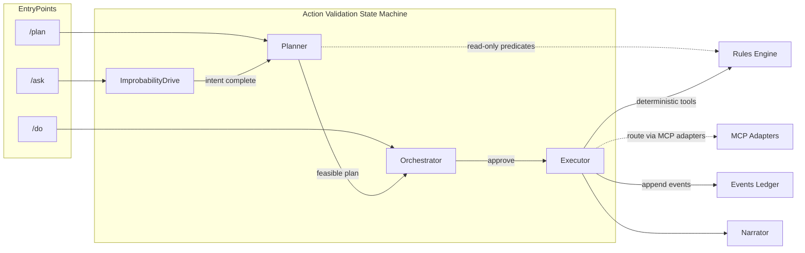
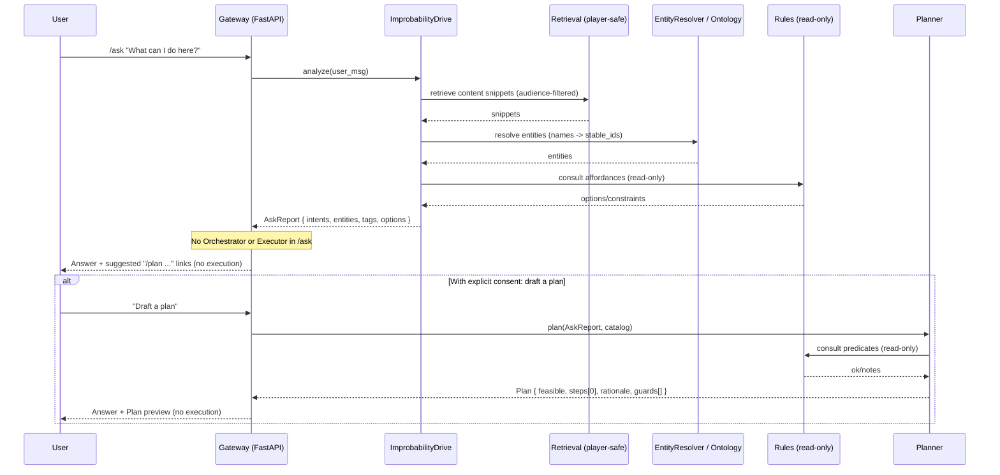
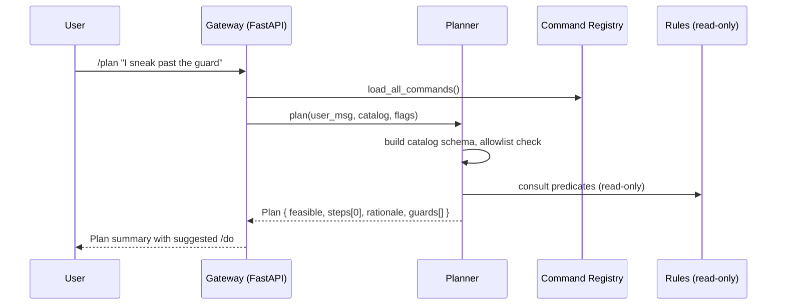
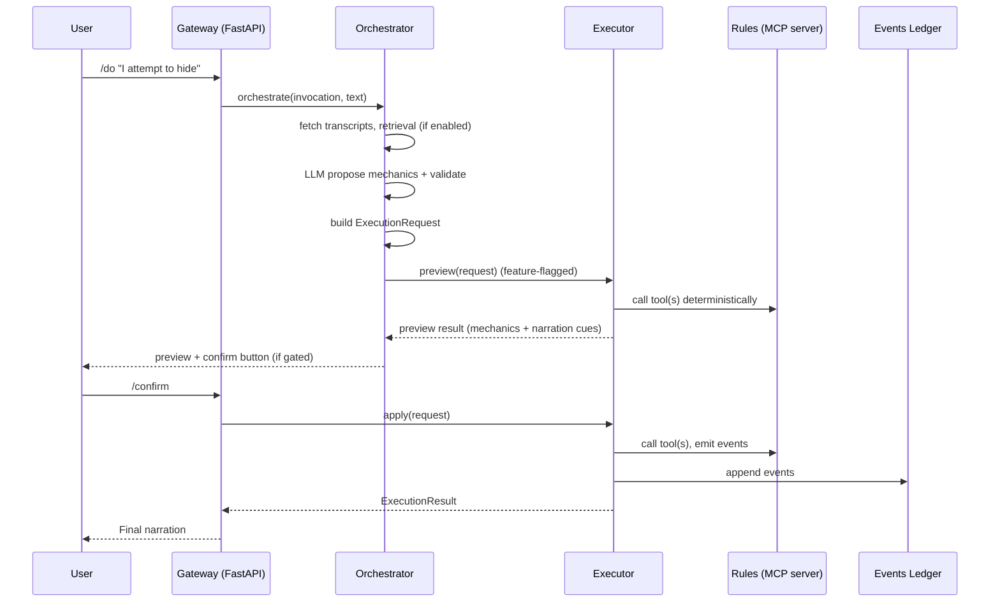

# The Ask / Plan / Do Machine

Adventorator separates thinking about actions from taking actions so play stays rich and safe. The three entrypoints—/ask, /plan, and /do—are deliberately scoped so each does one job well, can delegate when out of scope, and leaves a clean audit trail.

Why this separation works:
- Player: /ask "What’s around the altar?" → Narrates nearby features and hints. No state changes.
- Player: /ask "How could we cross the chasm?" → Lists options (rope, leap, bridge) and offers to draft a /plan.
- Player: /plan "sneak past the guard" → Produces a strict, safe step (e.g., check ability=stealth), previews feasibility and guards, and offers a ready /do.
- Player: /do "I drink the health potion" → Executes the one action deterministically, then narrates the result.
- Player: /do "I move behind the goblin and backstab" → Too complex for a single atomic action; transparently delegates up to the Planner, returns a short plan, then guides you to confirm the individual /do steps.

These commands are user-facing entry points into the ImprobabilityDrive → Planner → Orchestrator → Executor state machine. Each stage is governed by feature flags, logs structured events, and writes ActivityLog records—so we can roll forward safely and roll back cleanly.

Feature flags (config.toml)
- [planner].enabled — gate planner usage
- [features].action_validation, [features].predicate_gate — AVA stages and Predicate Gate
- [features].executor, [features].executor_confirm — preview/apply + confirm gates
- [features.retrieval].enabled — retrieval augmentation in orchestration
- [features].mcp — Executor routes via MCP adapters

State machine (high‑level)


---

## Command roles, boundaries, and smart delegation

This follows a CQRS-like split: /ask and /plan are read-only queries; /do is a command executor for one atomic action. When a request is out of scope, the handler delegates up or down the abstraction chain before responding—preserving a friendly UX while keeping boundaries crisp.

### /ask — Possibility and intent framing (read‑only)
- Purpose: Answer questions about the service, campaign, and rules system, and help the player form an actionable intent.
- Scope: No world state changes. Does not use the Orchestrator or Executor. May consult read-only world data.
- Output: A narrated answer and, when appropriate, an offer to “draft a /plan.”
- Delegation: Suggests a /plan (default). Optionally, with explicit user opt‑in, can hand off to Planner in-band without touching orchestrator/executor.

Examples
- “Who is in my party?” → Lists current party from read-only state.
- “Can I reach the goblin this turn?” → Explains movement rules, then offers a /plan suggestion for “move then attack.”
- “How do advantage and stealth interact?” → Explains rules, links to a suggested /plan stealth attempt.

Delegation semantics
- Default: Suggest-only. “This looks actionable: try /plan \"sneak past the guard\".”
- Optional hand-off: If enabled, “I can draft that plan for you—proceed?” On consent, invoke Planner, then return the Plan preview in the same reply. Still no execution.

### /plan — Feasibility and step generation (read‑only)
- Purpose: Map freeform intent to a strict, safe step and preview feasibility. Enforces an allowlist: {roll, check, sheet.create, sheet.show, do}.
- Scope: Read-only. Consults repos/rules for predicates; never mutates.
- Output: Plan with rationale/guards; offers to execute the resulting /do.
- Delegation: If the ask is purely informational (e.g., “What are my options?”), it may delegate up to /ask for richer explanation. If the plan implies multiple actions, it returns an ordered suggestion list of single /do steps (no execution).

Examples
- “I want to sneak past the guard” → Plan: check ability=stealth (with DC guidance if known), preview feasibility and predicate guards.
- “Can I shove then dash?” → Explains action economy and suggests a two-step sequence of /do commands; does not execute.
- “What are my options to cross the chasm?” → Enumerates approaches, links to one-click /plan drafts for each.

### /do — Execute one atomic action (deterministic)
- Purpose: Take one well‑formed action, craft the tool payload, execute deterministically, and narrate.
- Scope: /do itself does not mutate state; selected tools may append Events. It always handles a single atomic action.
- Output: Structured mechanics → narration, plus optional pending action/confirm flows.
- Delegation: If input implies multiple steps or unclear intent, /do delegates up to Planner to decompose, then returns the suggested list of single‑action /do commands for explicit confirmation.

Examples
- “I drink the health potion.” → Single tool apply; returns result and narration.
- “I attempt to hide.” → Maps to a stealth check tool; previews, confirms (if gated), applies, narrates.
- “I move behind the goblin and backstab him.” → Delegates to Planner, returns a short plan (move then attack), and invites you to run each /do explicitly.

Atomicity and narration
- Atomicity: /do executes exactly one action. Complex requests are decomposed by the Planner; you then confirm and run the steps as distinct /do commands.
- Narration: Tools return structured mechanics (e.g., action, target, dice, totals). A Narrator component turns that into prose; styles can be swapped without changing mechanics.

---

## Conditional chains

Conditional plans like "IF (Stealth > 15) THEN (Backstab) ELSE (Standard Attack)" are evaluated by a guarded plan sequencer. The design keeps `/do` atomic—each `/do` executes exactly one action—while a Plan Executor advances through a Plan step-by-step, evaluating predicates between steps and pausing for confirmations. Feature gates ensure no flow bypasses validation or confirmation.

---

## End-to-end sequences (summary)

/ask sequence (read-only; suggest-only by default; ImprobabilityDrive orchestrates analysis; Planner hand-off on consent)


/plan sequence (Planner returns Plan; it does not build ExecutionRequest)


/do sequence (Orchestrator builds ExecutionRequest; Executor routes via MCP adapters)


---

## Concrete examples

Example — /plan maps to a single-step check
Input: /plan "Do I notice the hidden door?"
```json
{
	"feasible": true,
	"plan_id": "plan_01H...",
	"steps": [
		{
			"op": "check",
			"args": { "ability": "perception", "advantage": false },
			"guards": []
		}
	],
	"rationale": "Perception check for noticing hidden features."
}
```
Follow-up: suggests /do check ability=perception

Example — /do builds an ExecutionRequest and previews
Input: /do "I try to hide behind the crates"
```json
{
	"plan_id": "plan_01H...",
	"steps": [
		{
			"op": "check",
			"args": { "ability": "stealth", "dc": 12 },
			"guards": []
		}
	],
	"context": {
		"actor": "Thalen",
		"location": "Warehouse 3",
		"recent_events": 5
	}
}
```
Executor preview returns mechanics and narration; apply emits Events upon confirm.

Example — smart delegation from /do to /plan
Input: /do "I climb the wall, draw my bow, and ambush the sentry"
- Handler recognizes multiple actions → delegates up to Planner
- Returns: a short Plan (climb → draw → attack), each as a suggested /do
- You run the steps one-by-one, confirming each action

---

## Low-level integration points

Command registration and invocation
- Decorators: @slash_command in `src/Adventorator/commanding.py`
- Loader: `src/Adventorator/command_loader.py` (load_all_commands)
- Invocation model and Responder abstraction used by all handlers

Planner internals
- Catalog: built from registry with Pydantic v2 option schemas
- Allowlist enforced: {roll, check, sheet.create, sheet.show, do}
- Predicate Gate (read-only) when enabled
- Metrics/logs: planner.request.initiated, planner.parse.valid, planner.validation.failed

Orchestrator internals
- Context: repos.fetch_transcripts, retrieval augmentation
- Defenses: schema validation, policy checks, rejection logging
- Output: OrchestratorResult (mechanics, narration cues)
- Builds `ExecutionRequest`; confirm flow gated by `[features].executor_confirm`

Executor and MCP adapters
- Tool registry and validation
- Preview/apply: deterministic ToolCallChain; emits Events on apply
- MCP routing: enabled by `[features].mcp`; Executor is the sole MCP client for writes

Rules and world model
- Deterministic mechanics: `src/Adventorator/rules/*`
- Event ledger: `src/Adventorator/models.py` (Event) + repos append helpers

Narration
- Tools return structured results; a Narrator component produces prose via the LLM
- Styles can vary (concise/GM) without changing mechanics

Feature flags and configuration
- Binding: `src/Adventorator/config.py`
- Flags: `[features].*`, `[planner].enabled`, `[features.retrieval].enabled`, `[ops].metrics_endpoint_enabled`

Observability
- Metrics counters: planner.parse.valid, executor.preview/apply, events.appended
- Logs: structured JSON with request_id, plan_id; ActivityLog records

References
- ARCH-AVA-001 — Action Validation Architecture: `../architecture/ARCH-AVA-001-action-validation-architecture.md`
- Planner: `src/Adventorator/planner.py`
- Orchestrator: `src/Adventorator/orchestrator.py`
- Executor: `src/Adventorator/executor.py`
- Tool registry: `src/Adventorator/tool_registry.py`
- Rules: `src/Adventorator/rules/*`
- Repos/Models: `src/Adventorator/repos.py`, `src/Adventorator/models.py`
- LLM adapter and Narrator: `src/Adventorator/llm.py`
- Config and flags: `src/Adventorator/config.py`, `config.toml`
